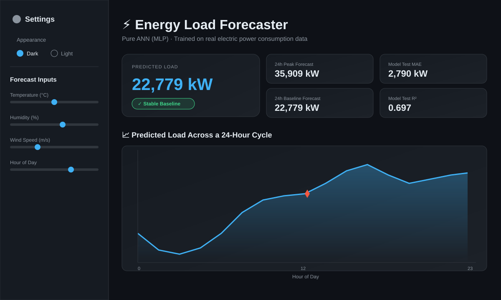
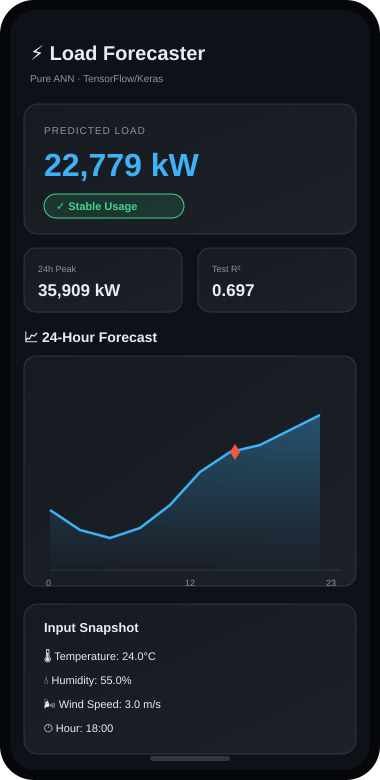

# ⚡ Energy Consumption & Load Forecaster

[](https://energy-consumption-load-forecaster-c8yheidpzectqd6zsctxgy.streamlit.app/)

### 📸 Preview

<p align="center">
  
</p>

<p align="center">
  
</p>

A production-grade, end-to-end web app that forecasts electric power load
using a **pure Artificial Neural Network (MLP)** in TensorFlow/Keras, built
around the [Fedesoriano Electric Power Consumption dataset](https://www.kaggle.com/datasets/fedesoriano/electric-power-consumption)
(Tetouan City, Morocco).

```
energy_forecast/
├── app.py                      # Phase 4: Streamlit UI (dark/light, responsive)
├── train.py                    # Offline training entry point (Phases 1+2, TensorFlow)
├── requirements.txt
├── .streamlit/config.toml      # Base Streamlit theme
├── data/
│   ├── powerconsumption.csv    # the REAL dataset (52,416 rows, included)
│   └── processed/              # cleaned.csv, train.csv, test.csv, split_arrays.npz
├── notebooks/
│   ├── 01_data_cleaning_and_eda.ipynb          # real, already-executed
│   ├── 02_feature_engineering_and_scaling.ipynb # real, already-executed
│   └── 03_model_training.ipynb                  # real, already-executed
├── src/
│   ├── data_pipeline.py        # Phase 1: cleaning, EDA helpers, features, scaling, split
│   ├── model.py                # Phase 2: ANN architecture, training, evaluation
│   └── validation.py           # Phase 3: input/type/range validation guardrails
├── utils/
│   └── generate_sample_data.py # Synthetic fallback (only used if data/ is empty)
└── artifacts/                  # model.h5 (from train.py) or model_sklearn_mlp.joblib (from notebooks), scalers, metrics
```

### About the real dataset

`data/powerconsumption.csv` is the actual [Fedesoriano / UCI Electric Power
Consumption dataset](https://www.kaggle.com/datasets/fedesoriano/electric-power-consumption)
— 52,416 real observations, 10-minute cadence, all of 2017, Tetouan City,
Morocco (CC BY 4.0, A. Salam & A. El Hibaoui, 2018). It's included in this
repo so everything below runs immediately, no manual download needed.

### About the notebooks — and an honesty note on model training

The three notebooks in `notebooks/` were **actually executed against this
real file** — every printed number, table, and chart in them is a genuine
output, not a mockup. Notebooks 01 and 02 (cleaning, EDA, feature
engineering, scaling, chronological split) use the same pandas/sklearn stack
as `src/data_pipeline.py` and need nothing exotic to reproduce.

Notebook 03 (model training) has one caveat worth knowing: it was built in a
sandboxed environment with **no internet access**, so `tensorflow` could not
be installed there. To still hand you a real, trained, evaluated model on
real data rather than a placeholder, notebook 03 trains an equivalent
architecture with `sklearn.neural_network.MLPRegressor` instead of Keras —
genuinely fit on your real training split, genuinely evaluated on the
untouched chronological test split (see the notebook for the real MAE /
RMSE / R² / MAPE, and an honest discussion of a real train-vs-test
generalization gap it surfaced). **`src/model.py` and `train.py` contain the
actual spec'd Keras architecture** (`Dense`+`Dropout`, `EarlyStopping`,
`ModelCheckpoint`, saved as `model.h5`) — run `train.py` anywhere with
internet access (your machine, Colab, Kaggle Notebooks) to get that exact
model trained on this same real data.

---

## 1. How it works

### Phase 1 — Data pipeline (`src/data_pipeline.py`)
- Renames raw Kaggle columns to clean snake_case.
- **Cleaning:** parses/validates timestamps (drops unparsable rows), sorts
  chronologically, deduplicates, interpolates missing values, nulls out
  physically impossible readings (humidity outside 0–100%, negative wind,
  temperature outside -30…55°C) and re-interpolates, then clips 3-sigma
  statistical outliers.
- **EDA:** `correlation_matrix()` and `target_distribution_summary()`
  (skewness/kurtosis/IQR-spike counts) for quick diagnostics.
- **Feature engineering:** extracts `hour`, `day_of_week`, `month`,
  `is_weekend`, `is_holiday` from the timestamp (holiday = named public
  holiday OR Sunday proxy — pass your own `holiday_dates` set for a real
  calendar).
- **Scaling:** `MinMaxScaler` fit **only on the training partition** for
  both features and target (prevents leakage).
- **Split:** strict chronological 80/20 split — no shuffling.

### Phase 2 — Model (`src/model.py`)
Pure feed-forward MLP:
```
Input(6) → Dense(128, relu) → Dropout(0.2)
         → Dense(64, relu)  → Dropout(0.2)
         → Dense(32, relu)  → Dropout(0.1)
         → Dense(1, linear)
```
Compiled with Adam + MSE loss. Overfitting control via Dropout,
`EarlyStopping` (restores best weights), `ModelCheckpoint` (saves best
`model.h5` by `val_loss`), and `ReduceLROnPlateau`.

### Phase 3 — Validation (`src/validation.py`)
Every prediction request is passed through `validate_all()` before it ever
reaches the model:
- Type coercion with friendly errors on bad strings (`"abc"` → clear message,
  not a crash).
- Temperature clamped to **-20°C…50°C**, humidity to **0–100%**, wind speed
  to **≥0 m/s** (ceiling 60 m/s), hour to **0–23**, day-of-week to **0–6**.
- The Streamlit layer renders these as inline red alert boxes and halts
  before calling `model.predict()`.

### Phase 4 — UI (`app.py`)
Streamlit + Plotly, with:
- A **custom CSS-variable theme system** giving a true runtime Dark/Light
  toggle (not just Streamlit's static `config.toml` theme).
- Responsive column layout that reflows on mobile/tablet/desktop.
- Sliders (with a manual text-input mode to demo Phase 3's type validation).
- A KPI card with the predicted load in kW, a peak/baseline badge, and a
  24-hour trend chart (sweeping hour 0–23 with your other inputs held fixed).

---

## 2. The dataset

`data/powerconsumption.csv` is already the **real** dataset — no download
needed. If you ever want to refresh it from the source:

- Kaggle: <https://www.kaggle.com/datasets/fedesoriano/electric-power-consumption>
- UCI (no login required): <https://archive.ics.uci.edu/dataset/849/power+consumption+of+tetouan+city>

Same 52,416-row file either way (identical column names:
`DateTime, Temperature, Humidity, Wind Speed, general diffuse flows,
diffuse flows, Zone 1 Power Consumption, Zone 2  Power Consumption, Zone 3  Power Consumption`
— note the real file has an inconsistent double space in the Zone 2/3
headers; `src/data_pipeline.py::load_raw_csv` normalizes this automatically).

If `data/powerconsumption.csv` is ever missing, `train.py` falls back to
generating a synthetic, schema-matched stand-in
(`utils/generate_sample_data.py`) so the pipeline never hard-fails — but you
shouldn't need that fallback with this repo as-is.

---

## 3. Run it locally

```bash
python -m venv venv
source venv/bin/activate          # Windows: venv\Scripts\activate

pip install -r requirements.txt

# Phase 1 + 2: clean data, engineer features, train the ANN, save artifacts
python train.py --data data/powerconsumption.csv

# Phase 4: launch the app
streamlit run app.py
```

Useful `train.py` flags: `--epochs 150 --batch-size 64 --dropout 0.2 --lr 1e-3`.

---

## 4. Deploy for free (no credit card)

### Option A — Streamlit Community Cloud
1. Push this project to a **public GitHub repo**, including the `artifacts/`
   folder (run `train.py` locally first and commit the resulting
   `model.h5`, `feature_scaler.joblib`, `target_scaler.joblib`) — Streamlit
   Cloud has no persistent training step, so artifacts must already exist
   in the repo.
2. Go to <https://share.streamlit.io>, sign in with GitHub (free, no card).
3. Click **"New app"** → select your repo/branch → set **Main file path**
   to `app.py`.
4. Under **Advanced settings**, set Python version to 3.11 (matches the
   pinned `tensorflow-cpu==2.16.1` in `requirements.txt`).
5. Click **Deploy**. Build takes a few minutes (TensorFlow install is the
   slow part). Your app gets a public `*.streamlit.app` URL.

### Option B — Hugging Face Spaces
1. Create a free account at <https://huggingface.co/join> (no card required).
2. Click **"New Space"** → choose **Streamlit** as the SDK → set visibility
   to Public (free tier).
3. Either connect the Space to your GitHub repo, or push directly:
   ```bash
   git clone https://huggingface.co/spaces/<your-username>/<space-name>
   cd <space-name>
   # copy in app.py, src/, utils/, artifacts/, requirements.txt, README.md
   git add .
   git commit -m "Deploy energy forecaster"
   git push
   ```
4. Hugging Face auto-builds from `requirements.txt` and runs `app.py`. Your
   Space gets a public URL like `https://huggingface.co/spaces/<user>/<space>`.

Both platforms' free tiers give a public URL, HTTPS, and auto-redeploy on
git push — no billing information needed for either.

---

## 5. Notes on the "pure ANN" constraint

Per spec, this system deliberately uses **only Dense/Dropout layers** — no
LSTM/GRU/1D-CNN — even though the data is time-series. Temporal signal is
instead injected via **engineered features** (`hour`, `day_of_week`,
`is_holiday`) rather than sequence modeling. If you later want to compare
against a recurrent model, that's a natural Phase 6 extension, but it's out
of scope here by design.